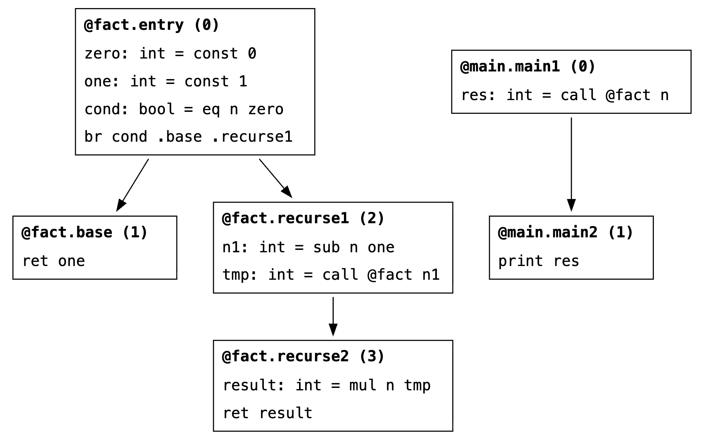

# Dataflow analysis

We built a generic dataflow analysis infrastructure, as well as implementations for the following concrete cases:

- Reaching definitions
- Constant propagation

## Testing

### Reaching definitions

We tested our implementation of the DFA algorithm for reaching definitions on two programs: `little.bril` (the diamond example from lecture), and `rec.bril` (a small recursive factorial implementation).

Here's the output of `bril2json < tests/dfa/reaching/little.bril | target/debug/bds df-reaching`. Note that parameters are recorded at the outgoing set of the first block of each function.

<details>
<summary>Output</summary>

```
block: f0.b0
  in:  
  out: a=fmainval0,
       b=fmainvbl1,
       cond=fmainvcondl0

block: f0.b1
  in:  a=fmainval0,
       b=fmainvbl1,
       cond=fmainvcondl0
  out: a=fmainval0,
       b=fmainvbl4,
       c=fmainvcl5,
       cond=fmainvcondl0

block: f0.b2
  in:  a=fmainval0,
       b=fmainvbl1,
       cond=fmainvcondl0
  out: a=fmainval8,
       b=fmainvbl1,
       c=fmainvcl9,
       cond=fmainvcondl0

block: f0.b3
  in:  a=fmainval0,
       a=fmainval8,
       b=fmainvbl1,
       b=fmainvbl4,
       c=fmainvcl5,
       c=fmainvcl9,
       cond=fmainvcondl0
  out: a=fmainval0,
       a=fmainval8,
       b=fmainvbl1,
       b=fmainvbl4,
       c=fmainvcl5,
       c=fmainvcl9,
       cond=fmainvcondl0,
       d=fmainvdl12
```
</details>

This output, which shows the outgoing reaching definitions for each block, matches precisely the results from lecture: on either side block, different definitions of `a`, `b`, and `c` reach. In particular, we notice how the left-hand path (through block 1) overwrites `b` and defines `c`, whereas the right-hand path (through block 2) overwrites `a` and defines `c`. Thus all six definitions of `a`, `b`, and `c` reach the end of the program, as well as the unchanged `cond`, and `d`, which is defined in block 3 (bottom block).

<p align="center">
</br>
<b>Figure 1:</b> CFG for <code>little.bril</code>.
</p>

Now consider the output for the recursive factorial program, `rec.bril`:

<details>
<summary>Output</summary>

```
block: f0.b0
  in:  
  out: cond=ffactvcondl3,
       n=ffactvnl0,
       one=ffactvonel2,
       zero=ffactvzerol1

block: f0.b1
  in:  cond=ffactvcondl3,
       n=ffactvnl0,
       one=ffactvonel2,
       zero=ffactvzerol1
  out: cond=ffactvcondl3,
       n=ffactvnl0,
       one=ffactvonel2,
       zero=ffactvzerol1

block: f0.b2
  in:  cond=ffactvcondl3,
       n=ffactvnl0,
       one=ffactvonel2,
       zero=ffactvzerol1
  out: cond=ffactvcondl3,
       n1=ffactvn1l8,
       n=ffactvnl0,
       one=ffactvonel2,
       tmp=ffactvtmpl9,
       zero=ffactvzerol1

block: f0.b3
  in:  cond=ffactvcondl3,
       n1=ffactvn1l8,
       n=ffactvnl0,
       one=ffactvonel2,
       tmp=ffactvtmpl9,
       zero=ffactvzerol1
  out: cond=ffactvcondl3,
       n1=ffactvn1l8,
       n=ffactvnl0,
       one=ffactvonel2,
       result=ffactvresultl11,
       tmp=ffactvtmpl9,
       zero=ffactvzerol1

block: f1.b0
  in:  
  out: n=fmainvnl0,
       res=fmainvresl1

block: f1.b1
  in:  n=fmainvnl0,
       res=fmainvresl1
  out: n=fmainvnl0,
       res=fmainvresl1
```
</details>

This output also matches our expectations. Note that this is an intraprocedural analysis, so the recursive call does not have an impact on the result.

<p align="center">
</br>
<b>Figure 2:</b> CFG for <code>rec.bril</code>.
</p>

The third program, Ackermann, is harder to manually verify, but some things can be stated about it:

<details>
<summary>Output</summary>

```
block: f1.b0
  in:  
  out: m=fmainvml0,
       n=fmainvnl0,
       tmp=fmainvtmpl0

block: f0.b0
  in:  
  out: cond_m=fackvcond_ml2,
       m=fackvml0,
       n=fackvnl0,
       one=fackvonel1,
       zero=fackvzerol0

block: f0.b1
  in:  cond_m=fackvcond_ml2,
       m=fackvml0,
       n=fackvnl0,
       one=fackvonel1,
       zero=fackvzerol0
  out: cond_m=fackvcond_ml2,
       m=fackvml0,
       n=fackvnl0,
       one=fackvonel1,
       tmp=fackvtmpl5,
       zero=fackvzerol0

block: f0.b2
  in:  cond_m=fackvcond_ml2,
       m=fackvml0,
       n=fackvnl0,
       one=fackvonel1,
       zero=fackvzerol0
  out: cond_m=fackvcond_ml2,
       cond_n=fackvcond_nl8,
       m=fackvml0,
       n=fackvnl0,
       one=fackvonel1,
       zero=fackvzerol0

block: f0.b3
  in:  cond_m=fackvcond_ml2,
       cond_n=fackvcond_nl8,
       m=fackvml0,
       n=fackvnl0,
       one=fackvonel1,
       zero=fackvzerol0
  out: cond_m=fackvcond_ml2,
       cond_n=fackvcond_nl8,
       m1=fackvm1l11,
       m=fackvml0,
       n=fackvnl0,
       one=fackvonel1,
       tmp=fackvtmpl12,
       zero=fackvzerol0

block: f0.b4
  in:  cond_m=fackvcond_ml2,
       cond_n=fackvcond_nl8,
       m=fackvml0,
       n=fackvnl0,
       one=fackvonel1,
       zero=fackvzerol0
  out: cond_m=fackvcond_ml2,
       cond_n=fackvcond_nl8,
       m1=fackvm1l15,
       m=fackvml0,
       n1=fackvn1l16,
       n=fackvnl0,
       one=fackvonel1,
       t1=fackvt1l17,
       t2=fackvt2l18,
       zero=fackvzerol0
```
</details>

Some observations can be made: as the CFG is traversed within each function, the reaching definitions sets start out empty and grow monotonically until they include at most one definition for each reached variable. While this last test does not guarantee correctness, it strengthens the claim to it.

### Constant propagation

#### armstrong

##### getDigits

<details>
<summary>Output</summary>

```
block: f1.b0
  in:  
  out: getDigitsone=1,
       getDigitsten=10,
       getDigitszero=0
```
</details>

these consts are const. they might persist with recursive calls.

<details>
<summary>Output</summary>

```
block: f1.b1
  in:  getDigitsone=1,
       getDigitsten=10,
       getDigitszero=0
  out: getDigitsone=1,
       getDigitsten=10,
       getDigitszero=0
```
</details>

nothing introduced

<details>
<summary>Output</summary>

```
block: f1.b2
  in:  getDigitsone=1,
       getDigitsten=10,
       getDigitszero=0
  out: getDigitsone=1,
       getDigitsten=10,
       getDigitszero=0
```
</details>

nothing introduced

##### mod

<details>
<summary>Output</summary>

```
block: f2.b0
  in:  
  out:
```
</details>

nothing introduced

##### main

<details>
<summary>Output</summary>

```

block: f0.b0
  in:  
  out: mainsum=0,
       mainten=10,
       mainzero=0

block: f0.b1
  in:  mainten=10,
       mainzero=0
  out: mainten=10,
       mainzero=0

block: f0.b2
  in:  mainten=10,
       mainzero=0
  out: mainten=10,
       mainzero=0

block: f0.b3
  in:  mainten=10,
       mainzero=0
  out: mainten=10,
       mainzero=0
```
</details>

no constants introduced.

##### power

<details>
<summary>Output</summary>

```
block: f3.b0
  in:  
  out: powerone=1,
       powerres=1,
       powerten=10,
       powerzero=0

block: f3.b1
  in:  powerone=1,
       powerten=10,
       powerzero=0
  out: powerone=1,
       powerten=10,
       powerzero=0

block: f3.b2
  in:  powerone=1,
       powerten=10,
       powerzero=0
  out: powerone=1,
       powerten=10,
       powerzero=0

block: f3.b3
  in:  powerone=1,
       powerten=10,
       powerzero=0
  out: powerone=1,
       powerten=10,
       powerzero=0
```
</details>

we see that powerres is no longer a constant after block 0!

#### gcd

<details>
<summary>Output</summary>

```
block: f0.b0
  in:  
  out: mainvc0=0

block: f0.b1
  in:  mainvc0=0
  out: mainvc0=0

block: f0.b2
  in:  mainvc0=0
  out: mainvc0=0

block: f0.b3
  in:  mainvc0=0
  out: mainvc0=0

block: f0.b4
  in:  mainvc0=0
  out: mainvc0=0

block: f0.b5
  in:  mainvc0=0
  out: mainvc0=0

block: f0.b6
  in:  mainvc0=0
  out: mainvc0=0

block: f0.b7
  in:  mainvc0=0
  out: mainvc0=0

block: f0.b8
  in:  mainvc0=0
  out: mainvc0=0
```
</details>

yes! vc0 is the only constant!

#### bbs

##### mod

<details>
<summary>Output</summary>

```
block: f0.b0
  in:  
  out: 
```
</details>
mod defines no constants.

##### lsb
<details>
<summary>Output</summary>

```
block: f1.b0
  in:  
  out: lsbtwo=2
```
</details>

the two is handled right!

##### square

<details>
<summary>Output</summary>

```
block: f2.b0
  in:  
  out: 
```
</details>

square defines no constants.

##### main

<details>
<summary>Output</summary>

```
block: f3.b0
  in:  
  out: mainstart=0

block: f3.b1
  in:  
  out: 

block: f3.b2
  in:  
  out: mainone=1
```
</details>

the constant one is only limited to this block.

<details>
<summary>Output</summary>

```
block: f3.b3
  in:  
  out: 
```
</details>
