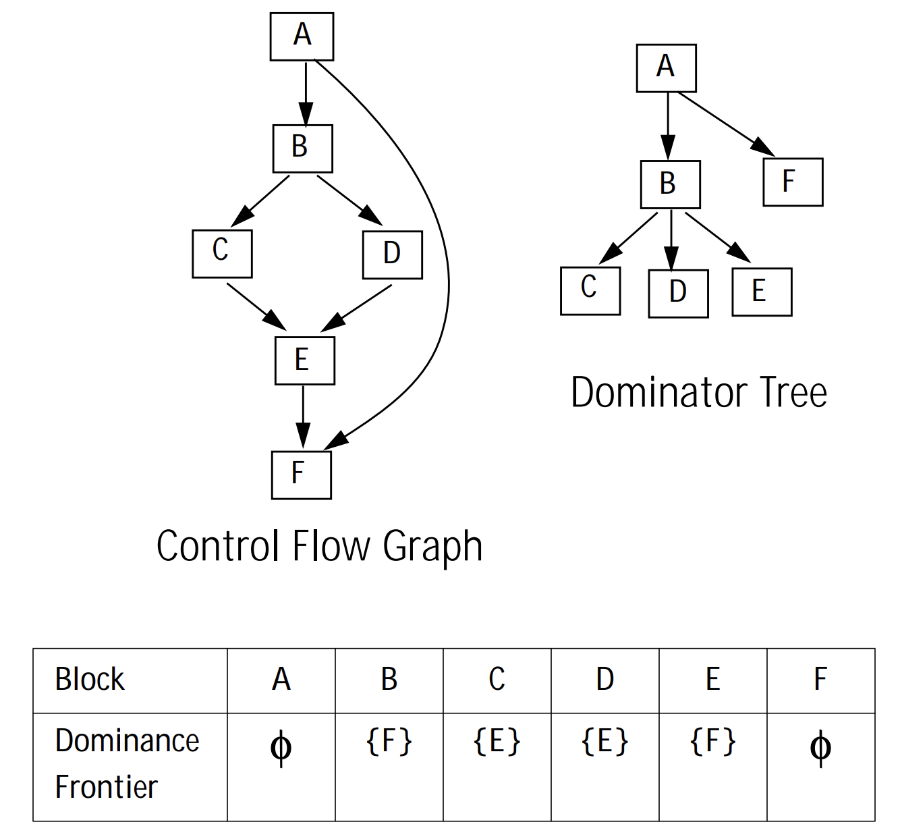

# Global analysis

We implemented some tools for global analysis, including those related to basic block dominance relations. We used Cooper, et al.'s pseudocode[^cooper] to implement a fast dominance frontier algorithm.

## Testing

<p align="center">
</br>
<b>Figure 1:</b> CFG, dominance tree and frontier for <code>wisc.bril</code>.<span markdown="1">[^wisc]</span>
</p>

We tested our dominance 


## test traces

in the following, dominance mapping lists which nodes dominate the given node.

tree lists which nodes are children of the given node.

### ``gcd``

invocation: ``bril2json < ../benchmarks/core/gcd.bril | target/debug/rust_stuff global``

Output:

```
main: block 0 -> main.b1
main: block 2 -> main.b4
main: block 5 -> main.b7 main.b6
main: block 4 -> main.b5 main.b8
main: block 6 -> main.b1
main: block 7 -> main.b1
main: block 8 ->
main: block 3 -> main.b4
main: block 1 -> main.b3 main.b2

func: main
dominance mapping:
f0.b1 -> f0.b1 f0.b0
f0.b0 -> f0.b0
f0.b6 -> f0.b0 f0.b6 f0.b5 f0.b4 f0.b1
f0.b2 -> f0.b0 f0.b2 f0.b1
f0.b4 -> f0.b1 f0.b4 f0.b0
f0.b8 -> f0.b4 f0.b1 f0.b8 f0.b0
f0.b7 -> f0.b4 f0.b1 f0.b5 f0.b0 f0.b7
f0.b3 -> f0.b0 f0.b1 f0.b3
f0.b5 -> f0.b0 f0.b4 f0.b1 f0.b5

tree:
f0.b0 -> f0.b1
f0.b1 -> f0.b2 f0.b3 f0.b4
f0.b5 -> f0.b6 f0.b7
f0.b4 -> f0.b5 f0.b8

frontier:
f0.b6: f0.b1
f0.b4: f0.b1
f0.b7: f0.b1
f0.b5: f0.b1
f0.b1: f0.b1
f0.b2: f0.b4
f0.b3: f0.b4
```

looking at the printed CFG, it is clear that block 0 and 1 dominate the subsequent blocks. There appears to be a split between blocks 2 and 3, which converges again at block 4; and then does some more funky things going forward.

the tree has an interesting case where block 1 dominates three blocks, due to the aforementioned branching behaviour. Joseph brought it up on Zulip [here](https://cs6120.zulipchat.com/#narrow/channel/254729-general/topic/domination.20tree.20technicalities/near/541945015).

The frontier for blocks 2 and 3 is block 4. Due to the aforementioned branch convergence, this is expected: neither strictly dominates b4. Ditto with b5... b7.

### ``armstrong``

output:
```
mod: block 0 ->
func: mod
dominance mapping:
f2.b0 -> f2.b0

tree:
f2.b0 ->

frontier:

main: block 3 ->
main: block 0 -> main.b1
main: block 1 -> main.b2 main.b3
main: block 2 -> main.b1
func: main
dominance mapping:
f0.b1 -> f0.b0 f0.b1
f0.b3 -> f0.b1 f0.b0 f0.b3
f0.b2 -> f0.b2 f0.b0 f0.b1
f0.b0 -> f0.b0

tree:
f0.b1 -> f0.b3 f0.b2
f0.b0 -> f0.b1

frontier:
f0.b1: f0.b1
f0.b2: f0.b1

power: block 0 -> power.b1
power: block 2 -> power.b1
power: block 1 -> power.b2 power.b3
power: block 3 ->
func: power
dominance mapping:
f3.b0 -> f3.b0
f3.b2 -> f3.b0 f3.b1 f3.b2
f3.b1 -> f3.b0 f3.b1
f3.b3 -> f3.b1 f3.b3 f3.b0

tree:
f3.b0 -> f3.b1
f3.b1 -> f3.b3 f3.b2

frontier:
f3.b2: f3.b1
f3.b1: f3.b1

getDigits: block 1 ->
getDigits: block 2 ->
getDigits: block 0 -> getDigits.b1 getDigits.b2
func: getDigits
dominance mapping:
f1.b1 -> f1.b1 f1.b0
f1.b2 -> f1.b0 f1.b2
f1.b0 -> f1.b0

tree:
f1.b0 -> f1.b1 f1.b2

frontier:

```

the ``mod`` function only has one block, so its dominance structures are pretty simple.

the ``main`` function has a pretty simple structure where b0 dominates b1 and b1 dominates both b2 and b3. This is reflected in the tree as well as the mapping.

(TODO: frontiers)

the ``power`` function has the same sort of structure, funnily enough.

the ``getDigits`` function removes the b1 layer.

### ``ackermann``

```
  main: block 0 ->
func: main
dominance mapping:
f1.b0 -> f1.b0

tree:
f1.b0 ->

frontier:

ack: block 4 ->
ack: block 2 -> ack.b3 ack.b4
ack: block 3 ->
ack: block 0 -> ack.b2 ack.b1
ack: block 1 ->
func: ack
dominance mapping:
f0.b0 -> f0.b0
f0.b3 -> f0.b3 f0.b0 f0.b2
f0.b2 -> f0.b2 f0.b0
f0.b4 -> f0.b2 f0.b4 f0.b0
f0.b1 -> f0.b0 f0.b1

tree:
f0.b0 -> f0.b1 f0.b2
f0.b2 -> f0.b3 f0.b4

frontier:
```

main is pretty straightforward.

the ``ack`` function can either return in b1, b3, or b4. b0 splits into either b1 or b2, which is reflected in the output. b2 is the 'gate' for b3 and b4, which is also reflected.


## References

[^cooper]: https://www.cs.tufts.edu/~nr/cs257/archive/keith-cooper/dom14.pdf
[^wisc]: https://pages.cs.wisc.edu/~fischer/cs701.f05/lectures/Lecture22.pdf
