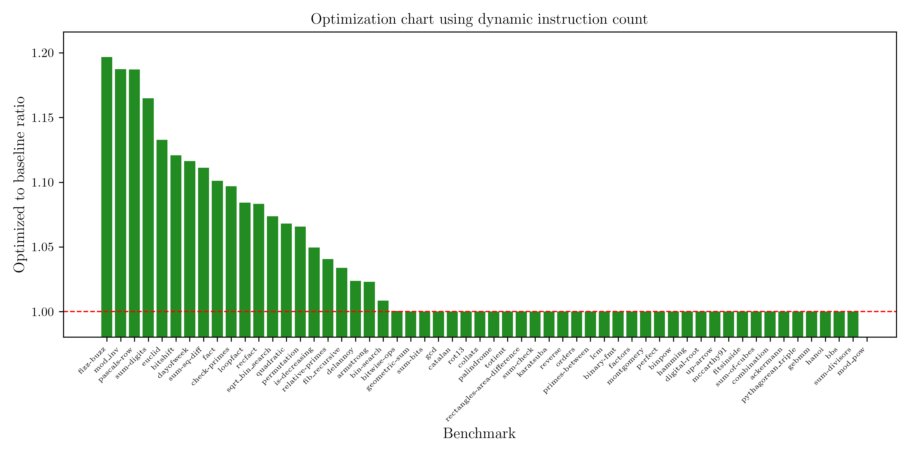

# Local optimization passes

## Testing

We use Brench to test optimizations against all the benchmarks at
`../benchmarks/core/*.bril`, and plot the results using a Python script (dependent on Pandas and Matplotlib).
This can be recreated by building with `cargo build`, then running Brench with:

```sh
brench brench.toml > benchmarks.csv
```

And finally running the Python script with `python plot.py`, which generates a file `benchmarks.png` that should look like this:


