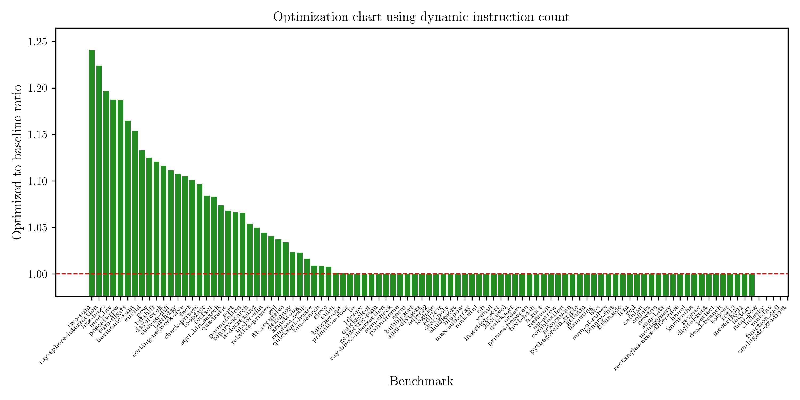
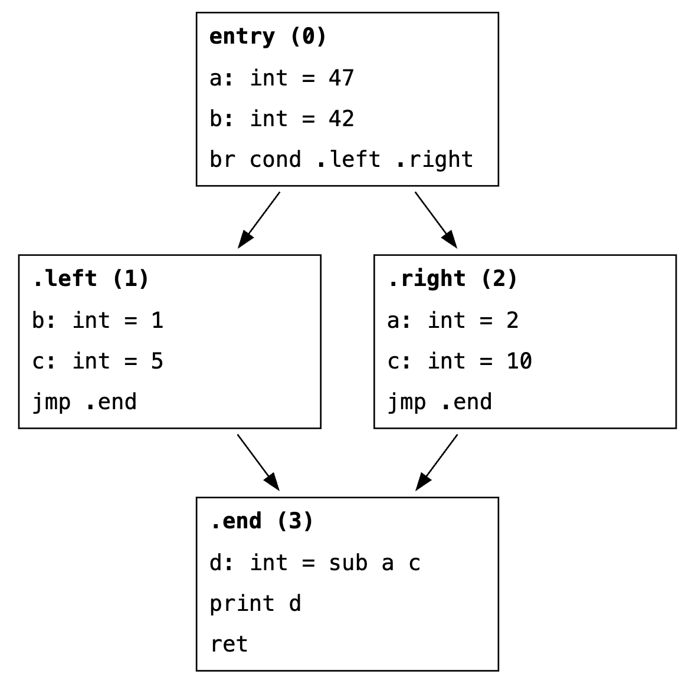

# Bril optimization

This is a tool for optimizing and analyzing Bril programs. It can be built with `cargo build` and can be run as follows:

```sh
# Run in file mode
target/debug/rust_stuff <path/to/program>.json {dce,lvn,df-reaching,df-const}

# Run in pipe mode from a '.bril' file
bril2json < <path/to/program>.bril | target/debug/rust_stuff {dce,lvn,df-reaching,df-const}
```

## Implemented modes

- `dce`: dead code elimination
- `lvn`: local value numbering
- `df-reaching`: reaching definitions dataflow analysis
- `df-const`: constant propagation dataflow analysis

## Testing

### Optimization passes

We use snapshot testing with Turnt, which can be run as follows:

```sh
turnt tests/*/*.bril
```

We also use Brench to test optimizations against all the benchmarks at
`../benchmarks/core/*.bril`, and plot the results using a Python script (dependent on Pandas and Matplotlib).
This can be recreated by building with `cargo build`, then running Brench with:

```sh
brench brench.toml > benchmarks.csv
```

And finally running the Python script with `python plot.py`, which generates a file `benchmarks.png` that should look like this:



### Dataflow analysis

#### Reaching definitions

We tested our implementation of the DFA algorithm for reaching definitions on two programs: `little.bril` (the diamond example from lecture), and `rec.bril` (a small recursive factorial implementation).

Here's the output of `bril2json < tests/reaching/little.bril | target/debug/rust_stuff df-reaching`. Note that parameters are recorded at the outgoing set of the first block of each function.

```json
block: f0.b0
in: []
out: [Defn { name: "fmainval0", var: "a" }, Defn { name: "fmainvbl1", var: "b" }, Defn { name: "fmainvcondl0", var: "cond" }]

block: f0.b1
in: [Defn { name: "fmainval0", var: "a" }, Defn { name: "fmainvbl1", var: "b" }, Defn { name: "fmainvcondl0", var: "cond" }]
out: [Defn { name: "fmainval0", var: "a" }, Defn { name: "fmainvbl4", var: "b" }, Defn { name: "fmainvcl5", var: "c" }, Defn { name: "fmainvcondl0", var: "cond" }]

block: f0.b2
in: [Defn { name: "fmainval0", var: "a" }, Defn { name: "fmainvbl1", var: "b" }, Defn { name: "fmainvcondl0", var: "cond" }]
out: [Defn { name: "fmainval8", var: "a" }, Defn { name: "fmainvbl1", var: "b" }, Defn { name: "fmainvcl9", var: "c" }, Defn { name: "fmainvcondl0", var: "cond" }]

block: f0.b3
in: [Defn { name: "fmainval0", var: "a" }, Defn { name: "fmainval8", var: "a" }, Defn { name: "fmainvbl1", var: "b" }, Defn { name: "fmainvbl4", var: "b" }, Defn { name: "fmainvcl5", var: "c" }, Defn { name: "fmainvcl9", var: "c" }, Defn { name: "fmainvcondl0", var: "cond" }]
out: [Defn { name: "fmainval0", var: "a" }, Defn { name: "fmainval8", var: "a" }, Defn { name: "fmainvbl1", var: "b" }, Defn { name: "fmainvbl4", var: "b" }, Defn { name: "fmainvcl5", var: "c" }, Defn { name: "fmainvcl9", var: "c" }, Defn { name: "fmainvcondl0", var: "cond" }, Defn { name: "fmainvdl12", var: "d" }]
```

This output, which shows the outgoing reaching definitions for each block, matches precisely the results from lecture: on either side block, different definitions of `a`, `b`, and `c` reach. In particular, we notice how the left-hand path (through block 1) overwrites `b` and defines `c`, whereas the right-hand path (through block 2) overwrites `a` and defines `c`. Thus all six definitions of `a`, `b`, and `c` reach the end of the program, as well as the unchanged `cond`, and `d`, which is defined in block 3 (bottom block).

<p align="center">
</br>
<b>Figure 1:</b> CFG for <code>little.bril</code>.
</p>

Now consider the output for the recursive factorial program, `rec.bril`:

```
block: f0.b0
in: []
out: [Defn { name: "ffactvcondl3", var: "cond" }, Defn { name: "ffactvnl0", var: "n" }, Defn { name: "ffactvonel2", var: "one" }, Defn { name: "ffactvzerol1", var: "zero" }]

block: f0.b1
in: [Defn { name: "ffactvcondl3", var: "cond" }, Defn { name: "ffactvnl0", var: "n" }, Defn { name: "ffactvonel2", var: "one" }, Defn { name: "ffactvzerol1", var: "zero" }]
out: [Defn { name: "ffactvcondl3", var: "cond" }, Defn { name: "ffactvnl0", var: "n" }, Defn { name: "ffactvonel2", var: "one" }, Defn { name: "ffactvzerol1", var: "zero" }]

block: f0.b2
in: [Defn { name: "ffactvcondl3", var: "cond" }, Defn { name: "ffactvnl0", var: "n" }, Defn { name: "ffactvonel2", var: "one" }, Defn { name: "ffactvzerol1", var: "zero" }]
out: [Defn { name: "ffactvcondl3", var: "cond" }, Defn { name: "ffactvn1l8", var: "n1" }, Defn { name: "ffactvnl0", var: "n" }, Defn { name: "ffactvonel2", var: "one" }, Defn { name: "ffactvtmpl9", var: "tmp" }, Defn { name: "ffactvzerol1", var: "zero" }]

block: f0.b3
in: [Defn { name: "ffactvcondl3", var: "cond" }, Defn { name: "ffactvn1l8", var: "n1" }, Defn { name: "ffactvnl0", var: "n" }, Defn { name: "ffactvonel2", var: "one" }, Defn { name: "ffactvtmpl9", var: "tmp" }, Defn { name: "ffactvzerol1", var: "zero" }]
out: [Defn { name: "ffactvcondl3", var: "cond" }, Defn { name: "ffactvn1l8", var: "n1" }, Defn { name: "ffactvnl0", var: "n" }, Defn { name: "ffactvonel2", var: "one" }, Defn { name: "ffactvresultl10", var: "result" }, Defn { name: "ffactvtmpl9", var: "tmp" }, Defn { name: "ffactvzerol1", var: "zero" }]

block: f1.b0
in: []
out: [Defn { name: "fmainvnl0", var: "n" }, Defn { name: "fmainvresl1", var: "res" }]

block: f1.b1
in: [Defn { name: "fmainvnl0", var: "n" }, Defn { name: "fmainvresl1", var: "res" }]
out: [Defn { name: "fmainvnl0", var: "n" }, Defn { name: "fmainvresl1", var: "res" }]
```

This output also matches our expectations. Note that this is an intraprocedural analysis, so the recursive call does not have an impact in the result.

<p align="center">
</br>
<b>Figure 2:</b> CFG for <code>rec.bril</code>.
</p>

The third program, Ackermann, is harder to manually verify, but some things can be stated about it:

```
block: f0.b0
in: []
out: [Defn { name: "fackvcond_ml2", var: "cond_m" }, Defn { name: "fackvml0", var: "m" }, Defn { name: "fackvnl0", var: "n" }, Defn { name: "fackvonel1", var: "one" }, Defn { name: "fackvzerol0", var: "zero" }]

block: f0.b1
in: [Defn { name: "fackvcond_ml2", var: "cond_m" }, Defn { name: "fackvml0", var: "m" }, Defn { name: "fackvnl0", var: "n" }, Defn { name: "fackvonel1", var: "one" }, Defn { name: "fackvzerol0", var: "zero" }]
out: [Defn { name: "fackvcond_ml2", var: "cond_m" }, Defn { name: "fackvml0", var: "m" }, Defn { name: "fackvnl0", var: "n" }, Defn { name: "fackvonel1", var: "one" }, Defn { name: "fackvtmpl5", var: "tmp" }, Defn { name: "fackvzerol0", var: "zero" }]

block: f0.b2
in: [Defn { name: "fackvcond_ml2", var: "cond_m" }, Defn { name: "fackvml0", var: "m" }, Defn { name: "fackvnl0", var: "n" }, Defn { name: "fackvonel1", var: "one" }, Defn { name: "fackvzerol0", var: "zero" }]
out: [Defn { name: "fackvcond_ml2", var: "cond_m" }, Defn { name: "fackvcond_nl8", var: "cond_n" }, Defn { name: "fackvml0", var: "m" }, Defn { name: "fackvnl0", var: "n" }, Defn { name: "fackvonel1", var: "one" }, Defn { name: "fackvzerol0", var: "zero" }]

block: f0.b3
in: [Defn { name: "fackvcond_ml2", var: "cond_m" }, Defn { name: "fackvcond_nl8", var: "cond_n" }, Defn { name: "fackvml0", var: "m" }, Defn { name: "fackvnl0", var: "n" }, Defn { name: "fackvonel1", var: "one" }, Defn { name: "fackvzerol0", var: "zero" }]
out: [Defn { name: "fackvcond_ml2", var: "cond_m" }, Defn { name: "fackvcond_nl8", var: "cond_n" }, Defn { name: "fackvm1l11", var: "m1" }, Defn { name: "fackvml0", var: "m" }, Defn { name: "fackvnl0", var: "n" }, Defn { name: "fackvonel1", var: "one" }, Defn { name: "fackvtmpl12", var: "tmp" }, Defn { name: "fackvzerol0", var: "zero" }]

block: f0.b4
in: [Defn { name: "fackvcond_ml2", var: "cond_m" }, Defn { name: "fackvcond_nl8", var: "cond_n" }, Defn { name: "fackvm1l11", var: "m1" }, Defn { name: "fackvml0", var: "m" }, Defn { name: "fackvnl0", var: "n" }, Defn { name: "fackvonel1", var: "one" }, Defn { name: "fackvtmpl12", var: "tmp" }, Defn { name: "fackvzerol0", var: "zero" }]
out: [Defn { name: "fackvcond_ml2", var: "cond_m" }, Defn { name: "fackvcond_nl8", var: "cond_n" }, Defn { name: "fackvm1l11", var: "m1" }, Defn { name: "fackvml0", var: "m" }, Defn { name: "fackvnl0", var: "n" }, Defn { name: "fackvonel1", var: "one" }, Defn { name: "fackvtmpl12", var: "tmp" }, Defn { name: "fackvzerol0", var: "zero" }]

block: f0.b5
in: [Defn { name: "fackvcond_ml2", var: "cond_m" }, Defn { name: "fackvcond_nl8", var: "cond_n" }, Defn { name: "fackvml0", var: "m" }, Defn { name: "fackvnl0", var: "n" }, Defn { name: "fackvonel1", var: "one" }, Defn { name: "fackvzerol0", var: "zero" }]
out: [Defn { name: "fackvcond_ml2", var: "cond_m" }, Defn { name: "fackvcond_nl8", var: "cond_n" }, Defn { name: "fackvm1l15", var: "m1" }, Defn { name: "fackvml0", var: "m" }, Defn { name: "fackvn1l16", var: "n1" }, Defn { name: "fackvnl0", var: "n" }, Defn { name: "fackvonel1", var: "one" }, Defn { name: "fackvt1l17", var: "t1" }, Defn { name: "fackvzerol0", var: "zero" }]

block: f0.b6
in: [Defn { name: "fackvcond_ml2", var: "cond_m" }, Defn { name: "fackvcond_nl8", var: "cond_n" }, Defn { name: "fackvm1l15", var: "m1" }, Defn { name: "fackvml0", var: "m" }, Defn { name: "fackvn1l16", var: "n1" }, Defn { name: "fackvnl0", var: "n" }, Defn { name: "fackvonel1", var: "one" }, Defn { name: "fackvt1l17", var: "t1" }, Defn { name: "fackvzerol0", var: "zero" }]
out: [Defn { name: "fackvcond_ml2", var: "cond_m" }, Defn { name: "fackvcond_nl8", var: "cond_n" }, Defn { name: "fackvm1l15", var: "m1" }, Defn { name: "fackvml0", var: "m" }, Defn { name: "fackvn1l16", var: "n1" }, Defn { name: "fackvnl0", var: "n" }, Defn { name: "fackvonel1", var: "one" }, Defn { name: "fackvt1l17", var: "t1" }, Defn { name: "fackvt2l18", var: "t2" }, Defn { name: "fackvzerol0", var: "zero" }]

block: f0.b7
in: [Defn { name: "fackvcond_ml2", var: "cond_m" }, Defn { name: "fackvcond_nl8", var: "cond_n" }, Defn { name: "fackvm1l15", var: "m1" }, Defn { name: "fackvml0", var: "m" }, Defn { name: "fackvn1l16", var: "n1" }, Defn { name: "fackvnl0", var: "n" }, Defn { name: "fackvonel1", var: "one" }, Defn { name: "fackvt1l17", var: "t1" }, Defn { name: "fackvt2l18", var: "t2" }, Defn { name: "fackvzerol0", var: "zero" }]
out: [Defn { name: "fackvcond_ml2", var: "cond_m" }, Defn { name: "fackvcond_nl8", var: "cond_n" }, Defn { name: "fackvm1l15", var: "m1" }, Defn { name: "fackvml0", var: "m" }, Defn { name: "fackvn1l16", var: "n1" }, Defn { name: "fackvnl0", var: "n" }, Defn { name: "fackvonel1", var: "one" }, Defn { name: "fackvt1l17", var: "t1" }, Defn { name: "fackvt2l18", var: "t2" }, Defn { name: "fackvzerol0", var: "zero" }]

block: f1.b0
in: []
out: [Defn { name: "fmainvml0", var: "m" }, Defn { name: "fmainvnl0", var: "n" }, Defn { name: "fmainvtmpl0", var: "tmp" }]

block: f1.b1
in: [Defn { name: "fmainvml0", var: "m" }, Defn { name: "fmainvnl0", var: "n" }, Defn { name: "fmainvtmpl0", var: "tmp" }]
out: [Defn { name: "fmainvml0", var: "m" }, Defn { name: "fmainvnl0", var: "n" }, Defn { name: "fmainvtmpl0", var: "tmp" }]
```

Some observations can be made: as the CFG is traversed within each function, the reaching definitions sets start out empty and grow monotonically until they include at most one definition for each reached variable. While this last test does not guarantee correctness, it strengthens the claim to it.

#### Constant propagation

Refer to the [constant propagation testing document](constprop.md).
