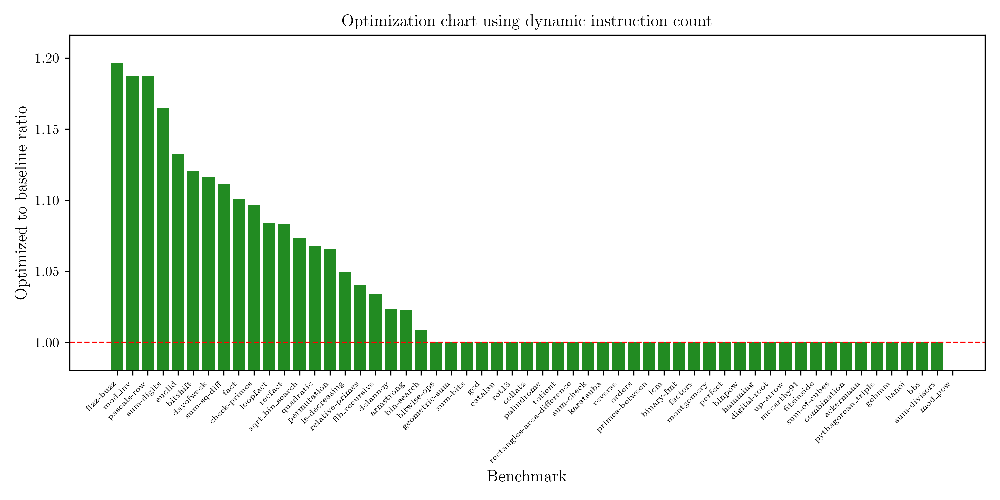

# Bril optimization

This is a tool that optimizes Bril programs using dead code elimination and local value numbering. It can be built with `cargo build` and can be run as follows:

```sh
# Run in file mode
target/debug/rust_stuff --mode file <path/to/program>.json {dce,lvn}

# Run in pipe mode from a '.bril' file
bril2json < <path/to/program>.bril | target/debug/rust_stuff --mode pipe - {dce,lvn}
```

## Implemented modes

- `dce` (dead code elimination): eliminates globally dead code (instructions whose results are never used) and locally dead code (reassignments before reads within a basic block).
- `lvn` (local value numbering): performs local value numbering to eliminate redundant expressions whose values are already calculated somewhere else.

## Testing

We use snapshot testing with Turnt for dead code elimination, which can be run as follows:

```sh
turnt tests/*/*.bril
```

More importantly, we use Brench to test the optimizations against all the benchmarks of the form
`../benchmarks/*/*.bril`, and plot the results using a Python script (dependent on Pandas and Matplotlib).
This can be recreated by building with `cargo build`, then running Brench with:

```sh
brench brench.toml > benchmarks.csv
```

And finally running the Python script with `python plot.py`, which generates a file `benchmarks.png` that should look like this:


